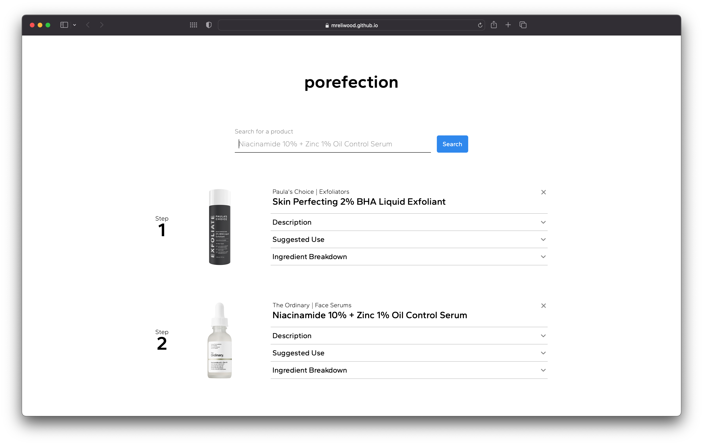

# porefection &nbsp; 
    
## Description

This web application helps users manage their skincare routine by allowing them to create a detailed list of their skincare products. When the user adds a product to their list, detailed product information is fetched from Sephora API and the list is automatically sorted in the correct order for using the products.

## Table of Contents

* [Deployed Application](http://mreliwood.github.io/porefection)
* [Usage](#usage)
* [License](#license)
* [Contributing](#contributing)
* [Tests](#tests)
* [Questions](#questions)

## Usage

1. Search for a product that's part of your skincare routine.
2. A list of common skincare porducts will be fetched from Sephora API and displayed on the screen.
    * If your search returned zero results, a list of suggested searches will be displayed instead.
3. Select a product to add it to your list.
4. After you've added two or more products, your list will be automatically sorted in the correct order for using your products.

## License

MIT License

Copyright &copy; 2022 porefection

## Contributing

* React.js
* Sephora API

## Tests

Extensive use case tests were performed on every function of this application.

## Questions

[mreliwood on GitHub](https://github.com/mreliwood) &nbsp; | &nbsp; [contact.eliwood@gmail.com](mailto:contact.eliwood@gmail.com)